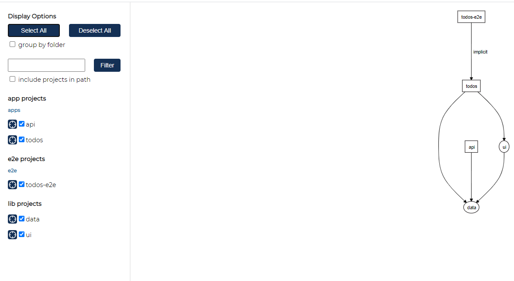

# nx
nx examples
based on https://nx.dev/angular/tutorial/01-create-application

## Problem 1
> :warning: because from some reason installer was not able download cypress I downloaded it via Chrome and set env. variable to point the downloaded zip file.

```
URL: https://download.cypress.io/desktop/4.10.0?platform=win32&arch=x64
Error: Corrupted download

Expected downloaded file to have checksum: 942175a19889a164b9715278afaa46d1e65b25f7ba5e808b286d24154175aefa22dfcef6f3a18577866d5b61c172cd33318b4c6848c0479f976241e33cada116
Computed checksum: 1ed51978b6d354f8c7397b3239221e51bb79326e2340c3d097693d1f8d5edfb383877c64341fcc6e9a7e2cf1f79b3dd5a04ab0bcea34b2e07ca56b6934406f6f

Expected downloaded file to have size: 187922715
Computed size: 185555310
```

To solve the above problem I did

```
set CYPRESS_INSTALL_BINARY=C:\Users\jkowalski\Downloads\cypress.zip
echo %CYPRESS_INSTALL_BINARY%

```
More about it can be found [here](https://docs.cypress.io/guides/getting-started/installing-cypress.html#Install-binary).

After this I was able to create new workspace but second error appeared during workspace creation but it seems that it has no impact on the application.

```
'.' is not recognized as an internal or external command,
operable program or batch file.
(node:15356) UnhandledPromiseRejectionWarning: Error: Command failed: ./node_modules/.bin/nx g @nrwl/nx-cloud:init --no-analytics
    at checkExecSyncError (child_process.js:616:11)
    at Object.execSync (child_process.js:652:15)
    at createApp (C:\Users\jkowalski\AppData\Roaming\npm-cache\_npx\15356\node_modules\create-nx-workspace\bin\create-nx-workspace.js:371:25)
```

## Problem 2

Next problem that I had to solve was issue with creating nest project:

```
D:\GitHub\kicaj29\nx\myorg> nx generate @nrwl/nest:app api --frontendProject=todos
Cannot read property 'types' of undefined
```

I had to run ```npm run update``` to upgrade to newer version and it fixed the problem.   
NOTE: command update is defined in package.json ```ng update @nrwl/workspace```
This operation upgraded libs from version 9 to version 10.

## Selected commands

### Create workspace
```npx create-nx-workspace@latest```  

### Install nest 
```npm install --save-dev @nrwl/nest```   

### Add nest project and link it with frontend project 
```nx g @nrwl/nest:app api --frontendProject=todos```   

### Serve app
```nx serve api```

### Run e2e tests 
```nx e2e todos-e2e --watch```   
>NOTE: From some reason this command did not run api service and it has to be run manually before starting e2e tests!


### Create library 
```nx g @nrwl/workspace:lib data```   
If you're using VS Code it may be necessary at this point to restart the TS server so that the new @myorg/data package is recognized. This may need to be done every time a new workspace library is added.   

### Create a angular library

* Create a library ```nx g @nrwl/angular:lib ui```
* Add a component to the library ```nx g component todos --project=ui --export```

### Dependency graph
```npm run dep-graph```



### Building Multiple Projects
nx run-many --target=build --projects="todos,api"

### Lint with dependencies
```nx lint todos --with-deps```

### Detect affected projects
```npm run affected:apps```
```npm run affected:libs```

### Test affected project (unit tests)
```nx affected:test```
```nx affected:test --only-failed```

### Running tasks for multiple projects in parallel
```nx run-many --target=build --all --parallel --maxParallel=8```

### Story book

#### Add the story book plugin
```npm install --save-dev @nrwl/storybook```

#### Create story book configuration
```nx g @nrwl/angular:storybook-configuration ui```
```
? Configure a cypress e2e app to run against the storybook instance? Yes
? Automatically generate *.stories.ts files for components declared in this library? Yes
? Automatically generate *.spec.ts files in the cypress e2e app generated by the cypress-configure schematic? Yes
```
>NOTE: if we are creating story book first time it will create also ```.storybook``` folder in the root folder and of course in the pointed project.

#### Run story book for selected project
```nx run ui:storybook```

#### Run Cypress Tests Against a Storybook Instance
```nx run ui-e2e:e2e```

It will run [todos.component.spec.ts](apps\ui-e2e\src\integration\todos\todos) from **ui-e2e** project (these are not unit test!).   

To debug run ```nx run ui-e2e:e2e --watch```

#### Creating a story in storybook for newly added component including e2e test for the storybook

First generate new component:
```nx g component slider --project=ui --export```

Next create a story for the newly created component:
```nx g @nrwl/angular:storybook-configuration --name=ui --generateStories```

```
PS D:\GitHub\kicaj29\nx-myorg> nx g @nrwl/angular:storybook-configuration --name=ui --generateStories
? Configure a cypress e2e app to run against the storybook instance? No
? Automatically generate *.spec.ts files in the cypress e2e app generated by the cypress-configure schematic? Yes
```

>NOTE: because cypress e2e app is already configured against the storybook instance we do not need to do it second time.

>:warning: although it was requested to generate e2e test in ui-e2e project for the new control this test was not generated. This job has to be done manually: easiest way is to copy existing *.spec.ts and update it.

# Links
https://blog.nrwl.io/storybook-support-run-many-command-ui-improvements-and-more-in-nx-8-8-90575cb5dda4   

[How to combine in one story book components from different angular libs](https://www.youtube.com/watch?v=c323HOuFKkA).